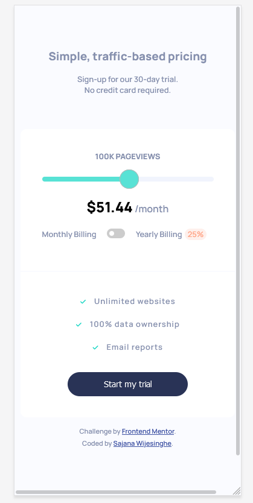

# Frontend Mentor - Interactive pricing component solution

This is a solution to the [Interactive pricing component challenge on Frontend Mentor](https://www.frontendmentor.io/challenges/interactive-pricing-component-t0m8PIyY8). Frontend Mentor challenges help you improve your coding skills by building realistic projects. 

## Table of contents

- [Overview](#overview)
  - [The challenge](#the-challenge)
  - [Screenshot](#screenshot)
  - [Links](#links)
- [My process](#my-process)
  - [Built with](#built-with)
  - [What I learned](#what-i-learned)
  - [Useful resources](#useful-resources)
- [Author](#author)

## Overview

### The challenge

Users should be able to:

- View the optimal layout for the app depending on their device's screen size
- See hover states for all interactive elements on the page
- Use the slider and toggle to see prices for different page view numbers

### Screenshot

#### Desktop View

#### Mobile View

### Links

- Solution URL: [https://github.com/StormKing969/Interacitve-Pricing-Component](https://github.com/StormKing969/Interacitve-Pricing-Component)
- Live Site URL: [https://stormking969.github.io/Interacitve-Pricing-Component/](https://stormking969.github.io/Interacitve-Pricing-Component/)

## My process

### Built with

- Semantic HTML5 markup
- SCSS custom properties
- Flexbox
- CSS Grid
- Mobile-first workflow
- JQuery

### What I learned

This project was used to improve my mastery of the SCSS coding style and use it together with jquery

## Author

- Website - [Sajana Wijesinghe](https://sajana-wijesinghe.com/)
- Frontend Mentor - [@StormKing969](https://www.frontendmentor.io/profile/StormKing969)